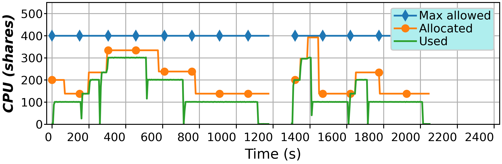
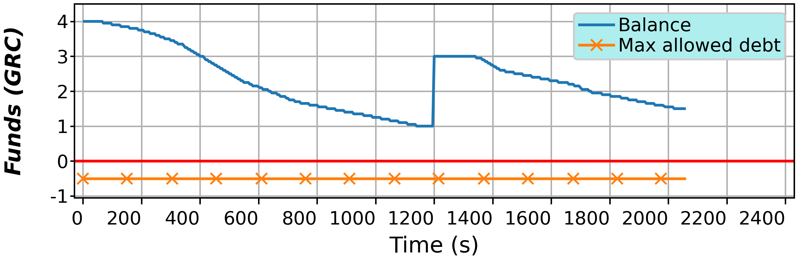
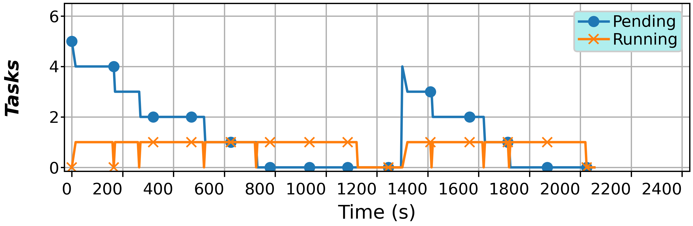
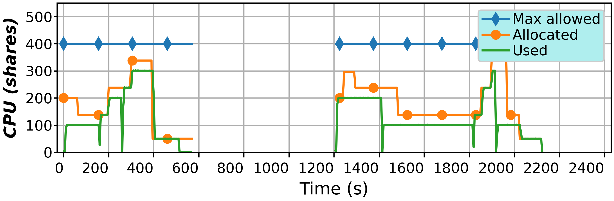
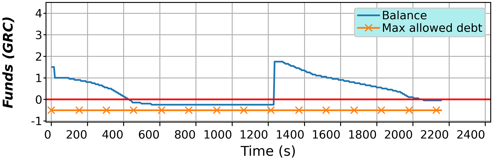
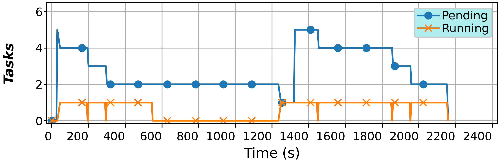
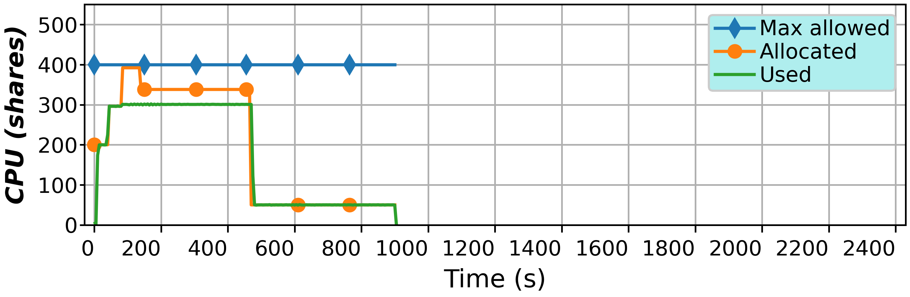
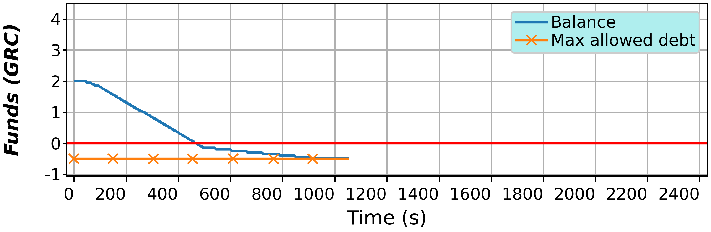
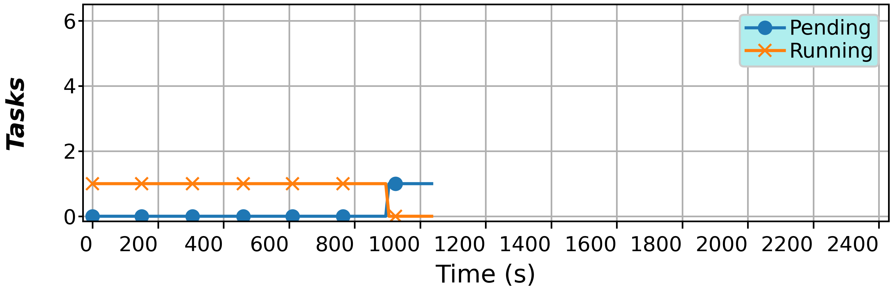

# BlockchainServerless

This repo contains the scripts and microservices to implement a **platform** that executes **tasks** in a **serverless** fashion, that is, accounting only the consumed resources, but with the addition that the **billing** of such resources is integrated with the use of a **blockchain**. Such billing is performed continually by charging the user's wallet. The user can transfer funds to this wallet at any time, thus controlling how much is spent on the tasks' execution. If no funds are available, although a small and configurable debt may be allowed at the cost of placing a resource restriction on the container, eventually such containers are stopped and any running task is aborted.

The tasks are executed using containers with the Apptainer engine. These containers are continuously scaled in terms of their resources to follow the serverless paradigm, all leveraging a modified version of the ServerlessContainer framework, available [here](https://github.com/UDC-GAC/ServerlessContainers/tree/blockchain-experiments). 
Both container images and tasks can be specified by the user by defining container image files (.def), and bash scripts for the tasks. Such tasks are oriented to the Function-as-a-Service (FaaS), so the scripts must be simple and written to process single pieces of data, which are hosted on a MinIO server.

Regarding the blockchain, **Gridcoin** has been used for its technical features, considering that it can be used in a live environment, and that also has a low barrier of entry. 

## Deployment

To deploy this platform, besides deploying the Serverless Containers framework, two microsrvices named ContainerManager and CreditManager have also to be running. To ease this deployment the script **deploy.sh** in the directory _deployment/scripts/single-node_ is provided. This script has the commands to clone and start the Serverless Container framework as well as the microservices and MinIO as the object storage used. This script also builds the container base images used.

This script assumes that all is deployed on a single node as a testing environment. If needed, this can be scaled to, as of now, two with the scripts in the directory  _deployment/scripts/multi-node_.

### Blockchain

Considering that the Gridcoin blockchain is used, it has to be properly deployed to manage funds and also carry out transfers. This means that at least one address has to be created, which has to be hosted on an actual server that is connected to the network. To simplify the use of this blockchain and integrate it in this platform, several scripts are also provided on the deployment/scripts/gridcoin folder:

* gridcoin-server.sh: installs the gridcoin server and configures it to connect to the network, afterwards it is started to synchronize the local blockchain copy. A link is also provided to use a snapshot.

* gridcoin-run.sh: runs the command to submit an operation to the server using the RPC method. The required environment parameters are used as argument in the call to authenticate it. This script is extensively used by the platform, although it can also be manually used. It also contains several examples of operations.

## Examples

A basic experiment is provided that uses the _stress_ utility to simulate a load that changes along time in steps of 1 core. This experiment is modulated by submitting task files to the MinIO storage, indicating the number of cores to stress and the duration. These task files are picked up by the ContainerManager, which will start a container when required and proceed to run the tasks managing their lifecycles. 
By using the Serverless Container framework, the container resources are scaled following the serverless paradigm, all with the objective of increasing resource utilization and reduce operation costs for the provider. 
Additionally, while the tasks are being executed, the CreditManager microservice will continually bill the user according to the resources consumed, deducting funds from the user's wallet and transfering them to the provider's wallet.

Next, several scenarios are depicted with different behaviours according to the number and duration of tasks, and the amount of funds.

### Normal execution

Under a normal execution, the user submits both tasks and enough funds to cover their execution, potentially doing so in batches. As seen in the next figures, the user sends a first batch of 5 tasks and 4 Gridcoins (GRCs), which are processed normally, with the container's resources being properly scaled, until around second 1200. 
Then, with an idle time of around 100 seconds, which causes the container to be stopped (note the discontinuation on the time series), a second batch of 4 tasks is sent, matched with a transaction of 1 GRC through the blockchain. These tasks are normally until the end of the execution. The user still has left around 1.8 GRC in funds which could be used in the future, or reclaimed.

  

### Debt-generating execution

It is also possible that during a task's execution the user's funds are depleted, which can be seen in the plots around second 400. In this case and in order to avoid losing any task progress, the infrastructure provider allows the user to incur some debt, in this case up to -0.5 GRC. Nevertheless, to avoid abuse, a resource restriction is placed that lowers the CPu to a configurable minimum value, in this case 500 CPU shares, all by leveraging the resource scaling mechanism from the serverless paradigm. Hopefully the task will still be able to finish under this restriction, which is the case in this scenario, finishing the restricted task around second 500. 
The generated debt will remain and any future funds transaction will have to cover it first, before any other tasks are started. This happens around second 1200 when a second batch of tasks and funds is sent.

  

### Aborted execution

On a last scenario, it is possible that the user does not send enough funds to run a task, and even when such funds run out and the task is placed under a resource restriction, the debt allowed by the provider to be generated reaches the maximum value. In this case, as a preventive measure, the provider can stop the container and abort the task, which is returned to the pool of pending tasks. Unfortunately in this case both the tasks' progress and the funds consumed are completely wasted.

  

## Used tools
- [Ansible](https://www.ansible.com/) - Configuration Management Tool
- [Apptainer](https://apptainer.org/) - Singularity/Apptainer Containers management tool
- [Python](https://www.python.org) - Programming language
- [Serverless Containers](https://bdwatchdog.dec.udc.es/serverless/) - Container resource scaling framework
- [BDWatchdog](https://bdwatchdog.dec.udc.es/monitoring/) - Resource monitoring framework

## Authors

* **Jonatan Enes** (https://gac.udc.es/~jonatan/)
* **Roberto R. Exp&oacute;sito** (https://gac.udc.es/~rober/)
* **Juan Touriño** (https://gac.udc.es/~juan/)

## License
This project is distributed as free software and is publicly available under the GNU GPLv3 license (see the [LICENSE](LICENSE) file for more details).

